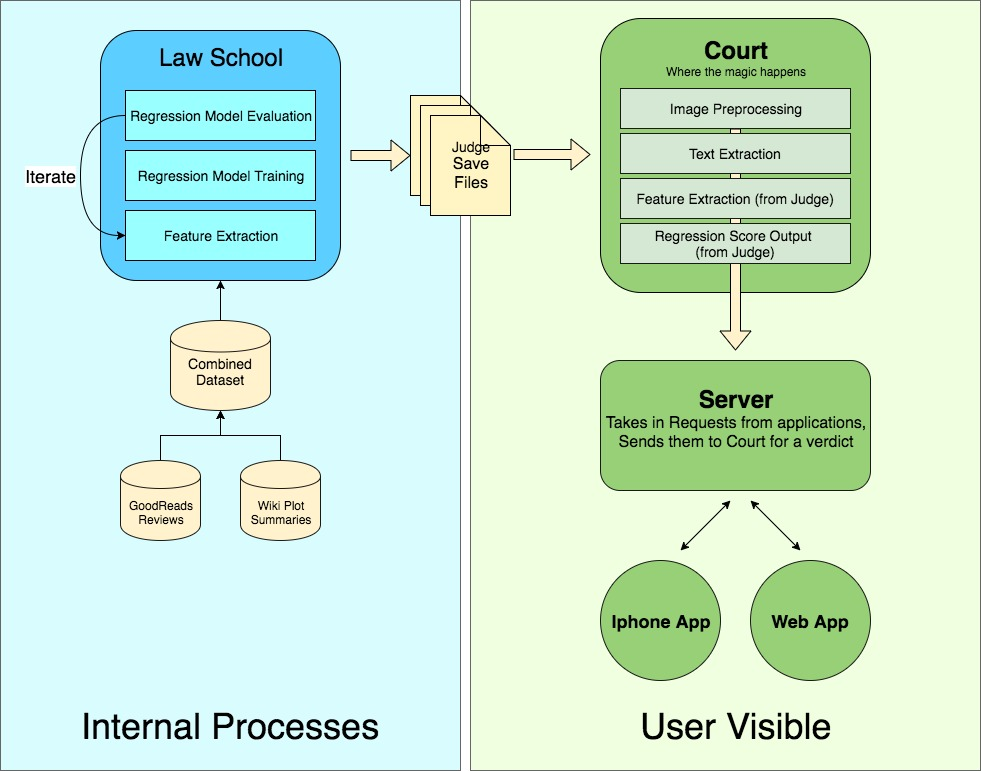

# Judge Mental
Judging Books by their Cover Since HackUMass F17

## What
A natural language processing system to judge a book by its synopsis, outputting a review score from 1-5 stars.

Apologies for the bad humor in our naming scheme.

## How
The pipeline breaks down into two parts:
1. The user visible application
2. The regression model training pipeline

Law-School is where the "Judges" are learned. A "Judge" consists of both a regression model to output a rating for a review and a feature extractor to be used to extract features to output the review. To train judges we tried numerous models from Linear Regression (with and without regularization) to Random Forests. After law school, a judge is saved to file for quick access in the Court.

The Court is where the Verdict takes place. A summary ("Evidence") is sent in from a user via the web application or the iphone app, and the server takes the Evidence to Court, where a Judge is called upon for a Verdict, which is returned. Of course the Judge must also "review other cases" (extract features similar to those it was trained on) in order to make a Verdict.

## Why
For fun. To practice the things we've been learning in NLP. For curiosity to see if there was a correlation between summaries and reviews.